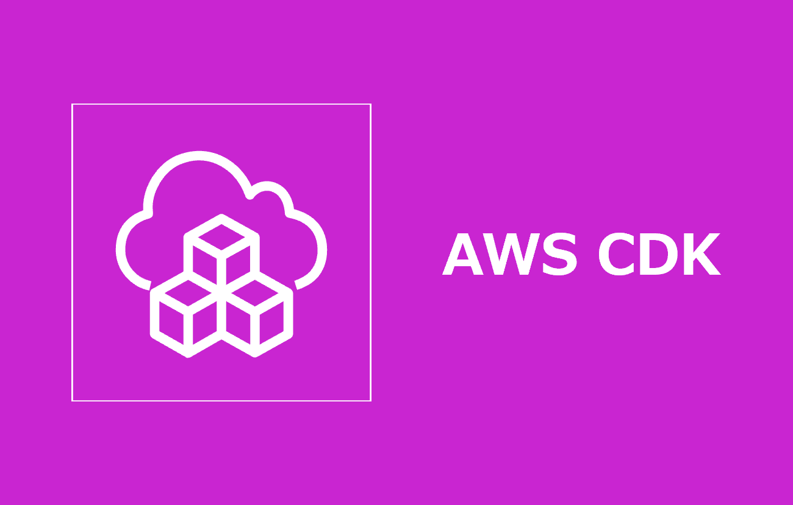

=====================================================================
AWS CDK インストール手順
=====================================================================

Windows
=====================================================================
1. *Typescript* のグローバルインストール
---------------------------------------------------------------------
.. code-block:: bash

  npm install -g typescript

.. note::

  * 以下のようなエラーが出た場合

  .. code-block:: bash

    error code UNABLE_TO_GET_ISSUER_CERT_LOCALL
    error errno UNABLE_TO_GET_ISSUER_CERT_LOCALLY
    error request to https://registry.npmjs.org/typescript failed, reason: unable to get local issuer certificate

  * 上記のエラーは証明書エラー
  * 企業など、クラウド型や自社内のproxyを使っている環境で発生したりします
  * OSの証明書ストアを更新する方法もありますが、今回は *node* の環境変数に該当の証明書のパスを指定することで、 *node* に証明書を認識させ対応する方法を記載します

  .. code-block:: bash

    # shell
    export NODE_EXTRA_CA_CERTS=/path/to/certificate.pem # 証明書の絶対パスを指定
    touch ~/.bashrc # .bashrcがない場合実行
    sed -i '$aexport NODE_EXTRA_CA_CERTS=/path/to/certificate.pem' ~/.bashrc

  .. code-block:: powershell

    # powershell
    $env:NODE_EXTRA_CA_CERTS="C:\path\to\certificate.pem"

2. *aws-cdk* のグローバルインストール
---------------------------------------------------------------------
.. code-block:: bash

  npm install -g aws-cdk

.. note::

  * *npm* によってグローバルインストールしたパッケージは「 *~/AppData/Roaming/nvm/{nodeバージョン番号}/node_modules/* 」に格納されている
  * グローバルパッケージは *node* のバージョン毎に管理されているため、 *node* のバージョンを切り替えた際は再度グローバルパッケージをインストールする必要がある

Mac
=====================================================================
1. *Typescript* のグローバルインストール
---------------------------------------------------------------------
.. code-block:: zsh
  
  pnpm install -g typescript

2. *aws-cdk* のグローバルインストール
---------------------------------------------------------------------
.. code-block:: zsh

  pnpm install -g aws-cdk

初期作業 - Typescript
=====================================================================
プロジェクト作成
---------------------------------------------------------------------
.. code-block:: zsh

  mkdir app && cd app

.. note::

  * フォルダ名は任意です
  * 初期化した際に「 ``フォルダ名-stack.ts`` 」 でスタックファイルが、「 ``フォルダ名.ts`` 」でアプリケーションファイルが作成されます

.. code-block:: zsh

  cdk init --language typescript --package-manager pnpm

BootStrap
---------------------------------------------------------------------
.. code-block:: zsh

  cdk bootstrap

.. note::

  * プロジェクトフォルダ直下で実施すること

参考資料
=====================================================================
リファレンス
---------------------------------------------------------------------
* `AWS CDK で使用する環境をブートストラップする - AWS クラウド開発キット (AWS CDK) v2 デベロッパーガイド <https://docs.aws.amazon.com/ja_jp/cdk/v2/guide/bootstrapping-env.html>`_
* `AWS CDK ブートストラップをカスタマイズする - AWS クラウド開発キット (AWS CDK) v2 デベロッパーガイド <https://docs.aws.amazon.com/ja_jp/cdk/v2/guide/bootstrapping-customizing.html>`_

ブログ
---------------------------------------------------------------------
* `cdk bootstrapが何者なのか正面から向き合う <https://blog.mmmcorp.co.jp/2025/02/18/face-to-what-cdk-bootstrap-is/>`_
