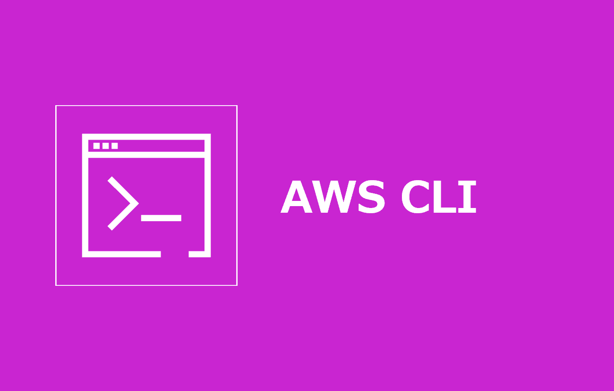

# AWS Command Line Interface インストール手順

> [!NOTE]
> - AWS の各サービスをコマンドラインから操作する公式 CLI
> - マネジメントコンソールを使わずに、AWS リソースの操作・確認やスクリプトによる自動化を行うために使用

## Windows

### 1. パッケージサイレントインストール

Powershellにて以下コマンドを実行

```powershell
msiexec.exe /i https://awscli.amazonaws.com/AWSCLIV2.msi /qn
```

### 2. インストール確認

```powershell
aws --version
```

## Mac

### 1. *AWS CLI* インストール

```zsh
mise install aws
mise use --global aws@latest
```

> [!NOTE]
> - *mise* のセットアップは [こちら](../mise-en-place/README.md) を参照

### 2. `symlink_bins` 設定

- `~/.config/mise/config.toml` の `[tools]` に追加された *aws* の行を以下に修正

```toml
aws = { version = "latest", symlink_bins = "true" }
```

> [!NOTE]
> - *mise* でインストールした *AWS CLI* はパッケージ内の深い階層に実行ファイルが配置されます
> - `symlink_bins` を有効にすると、実行ファイル ( `aws` / `aws_completer` ) へのシンボリックリンクが作成され PATH に追加されます
> - `aws --version` でバージョンが表示されればOKです

> [!WARNING]
> - `symlink_bins` を設定しない場合、実行ファイルが配置されたディレクトリ自体が PATH に追加されます
> - 同ディレクトリには *AWS CLI* 同梱の `Python` / `python3.14` や各種ライブラリも含まれるため、以下の問題が発生し得ます
>   - macOS は大文字小文字を区別しないため、 `python` コマンドが *AWS CLI* 同梱の `Python` に解決され、 *uv* や *pyenv* でインストールした *Python* より優先される
>   - *uv* 等でインストールした同名バージョンの `python3.x` と衝突する
>   - 不要なコマンドが補完候補に表示される

## 参考資料

### リファレンス

- [AWS CLI の最新バージョンのインストールまたは更新](https://docs.aws.amazon.com/ja_jp/cli/latest/userguide/getting-started-install.html)
