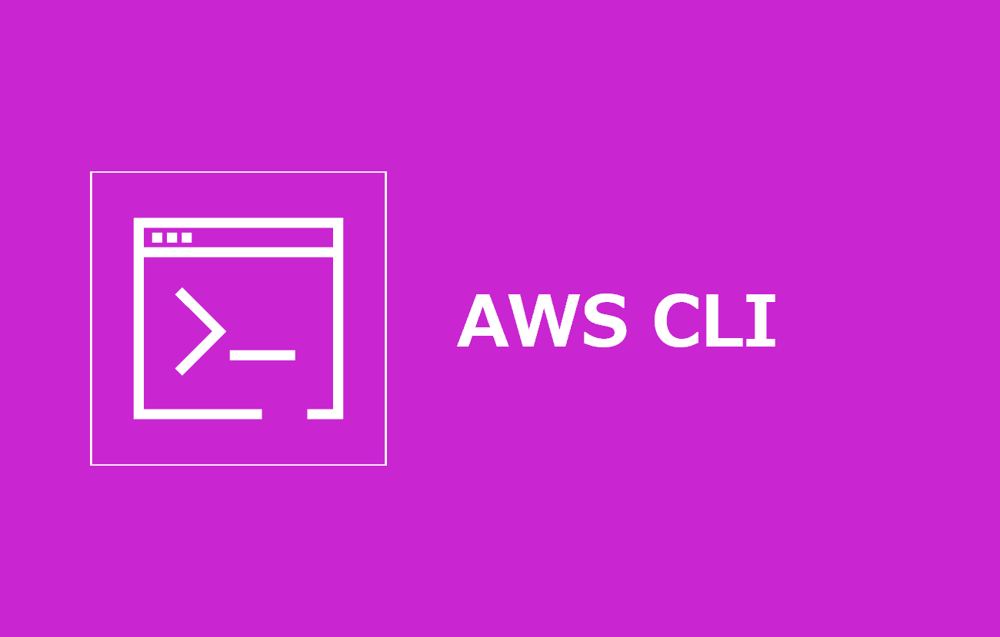

=====================================================================
AWS Command Line Interface インストール手順
=====================================================================

Windows
===================
1. パッケージサイレントインストール
-----------------------------------
Powrshellにて以下コマンドを実行

.. code-block:: powershell

  msiexec.exe /i https://awscli.amazonaws.com/AWSCLIV2.msi /qn

2. インストール確認
-----------------------------------
.. code-block:: powershell

  aws --version

参考資料
===============================
リファレンス
-------------------------------
* `AWS CLI の最新バージョンのインストールまたは更新 <https://docs.aws.amazon.com/ja_jp/cli/latest/userguide/getting-started-install.html>`_
