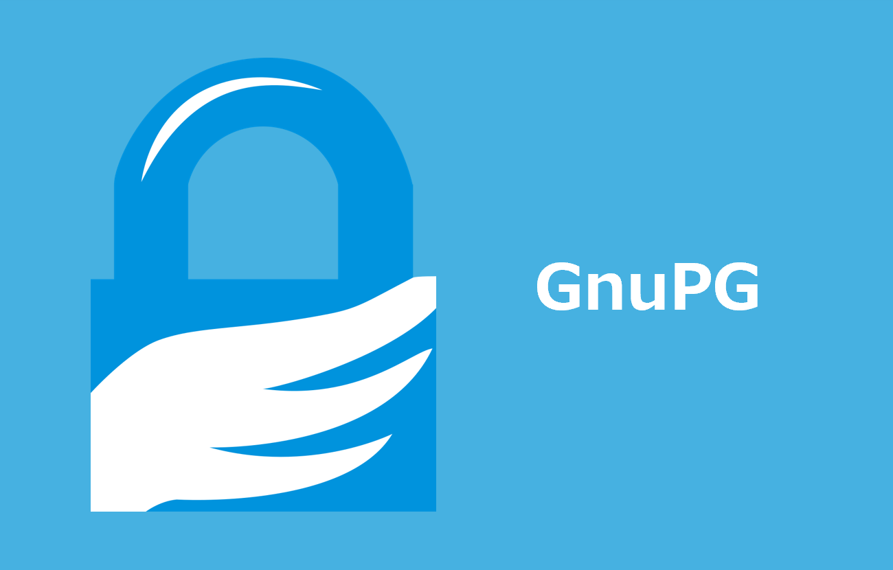

# GnuPG インストール手順

> [!NOTE]
> - OpenPGP 標準に準拠した暗号化・電子署名ツール
> - Git のコミットに署名し、作成者を証明するために使用

## Windows

> [!NOTE]
> - *Git for Windows* には *GnuPG* が同梱されているため、 *Git Bash* 上で利用するだけであれば本手順は不要です ( *Git for Windows* のインストールは [こちら](../git/README.md) )
> - *Git Bash* 以外 ( PowerShell や GUI の鍵管理ツール *Kleopatra* 等) でも利用したい場合は、以下の手順で *Gpg4win* をインストールしてください

### 1. *GnuPG* バイナリデータダウンロード

- [GnuPG](https://gnupg.org/download/index.html) からWindows版バイナリ( *gpg4win-4.4.0.exe* )をダウンロード

> [!TIP]
> - ダウンロード時に寄付を求められますが、しなくても大丈夫です。(してもOKです。)
> - 寄付しない場合は *$0* をクリックし、「 *Donate & Download* 」をクリックします。

### 2. インストーラ実行

- *gpg4win-4.4.0.exe* をダブルクリックし、インストーラを実行

> [!NOTE]
> - デフォルト設定で問題ありません。

## 参考資料

### ブログ

- [【Windows】GnuPG(GPG)インストール方法:(2022年版)](https://www.ochappa.net/posts/gpg-win-setup)
- [macOS / Windows の Git 用に GnuPG (GPG) を準備する](https://qiita.com/watagashi/items/9425599678f6f93a0910)
