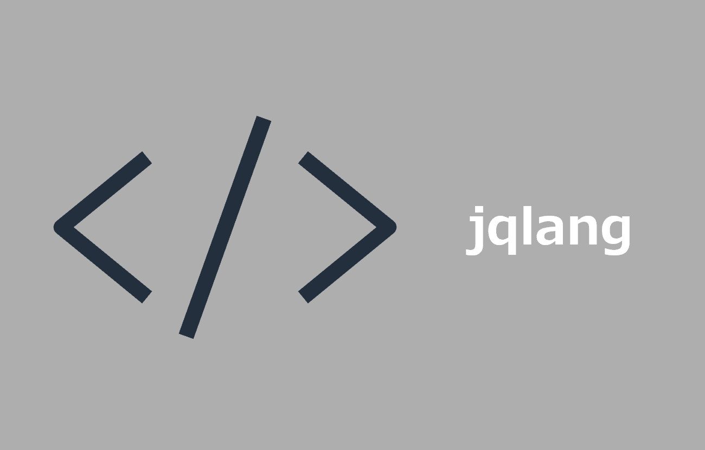

# jq(JSONコマンドライン処理ツール) インストール手順

> [!NOTE]
> - JSON をコマンドラインで整形・抽出・加工するツール
> - AWS CLI などが出力する JSON から、必要な値を取り出すために使用

## Windows (Git for Windows)

### 1. *jq* リソースバイナリダウンロード

- [GitHub](https://github.com/jqlang/jq/releases) から64bit版バイナリ( *jq-windows-amd64.exe* )をダウンロード

```bash
curl -o ~/Downloads/#1 -OL https://github.com/jqlang/jq/releases/download/jq-1.7.1/{jq-windows-amd64.exe}
```

### 2. バイナリデータを任意のフォルダに解凍

```bash
mkdir ~/jq
mv ~/Downloads/jq-windows-amd64.exe ~/jq
```

### 3. ディレクトリにPATHを通す

```bash
echo 'export PATH=$PATH:$HOME/jq' >> ~/.bashrc
echo 'alias jq='jq-windows-amd64.exe'' >> ~/.bashrc
source ~/.bashrc
```
