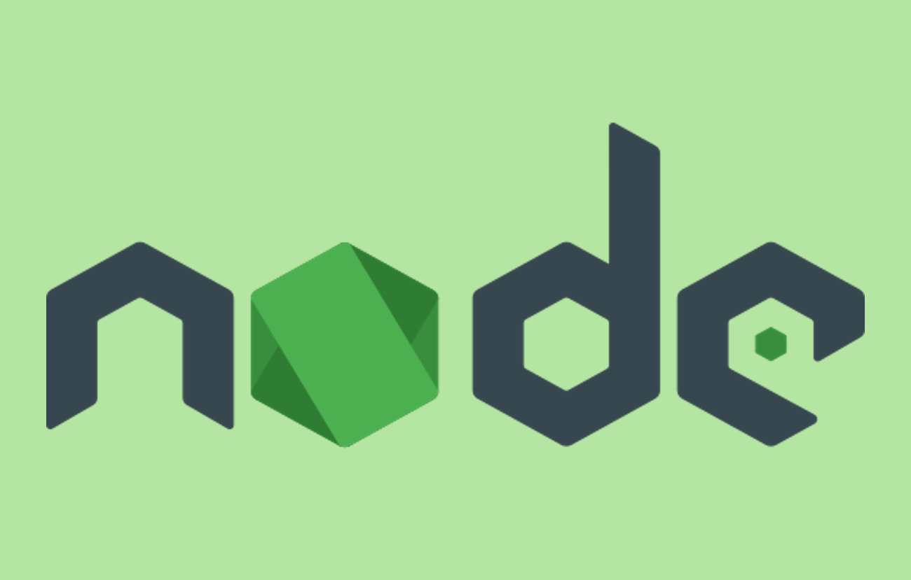

=====================================================================
NVM/NODE/Typescript/AWS CDK インストール手順
=====================================================================

Windows
=====================================================================
1. *nvm-windows* ( Windows版 *Node.js* バージョンマネージャー)インストール
---------------------------------------------------------------------
* `GitHub <https://github.com/coreybutler/nvm-windows>`_ から *nvm-setup.exe* をダウンロード
* デフォルト設定でインストール

2. *node.js* (LTS版) インストール
---------------------------------------------------------------------
.. code-block:: bash

  nvm install lts

3. LTS版の使用
---------------------------------------------------------------------
.. code-block:: bash

  nvm use 22.12.0

.. note::

  * バージョン `nvm list` でインストール済みの値を指定

4. *Typescript* のグローバルインストール
---------------------------------------------------------------------
.. code-block:: bash

  npm install -g typescript

.. note::

  * 以下のようなエラーが出た場合

  .. code-block:: bash

    error code UNABLE_TO_GET_ISSUER_CERT_LOCALL
    error errno UNABLE_TO_GET_ISSUER_CERT_LOCALLY
    error request to https://registry.npmjs.org/typescript failed, reason: unable to get local issuer certificate

  * 上記のエラーは証明書エラー
  * 企業など、クラウド型や自社内のproxyを使っている環境で発生したりします
  * OSの証明書ストアを更新する方法もありますが、今回は *node* の環境変数に該当の証明書のパスを指定することで、 *node* の証明書を認識させ対応する方法を記載します

  .. code-block:: bash

    # shell
    export NODE_EXTRA_CA_CERTS=/path/to/certificate.pem # 証明書の絶対パスを指定
    touch ~/.bashrc # .bashrcがない場合実行
    sed -i '$aexport NODE_EXTRA_CA_CERTS=/path/to/certificate.pem' ~/.bashrc

  .. code-block:: powershell

    # powershell
    $env:NODE_EXTRA_CA_CERTS="C:\path\to\certificate.pem"

5. *aws-cdk* のグローバルインストール
---------------------------------------------------------------------
.. code-block:: bash

  npm install -g aws-cdk

.. note::

  * *nvm* で管理している *node.js* のパッケージは「 *~/AppData/Roaming/nvm/{nodeバージョン番号}/* 」に格納されている
  * *npm* によってグローバルインストールしたパッケージは「 *~/AppData/Roaming/nvm/{nodeバージョン番号}/node_modules/* 」に格納されている
  * グローバルパッケージは *node* のバージョン毎に管理されているため、 *node* のバージョンを切り替えた際は再度グローバルパッケージをインストールする必要がある

参考資料
=====================================================================
ブログ
---------------------------------------------------------------------
* `nvmを使った際に、グローバルパッケージはどこに保存されるのかを確認したかったのでメモ <https://qiita.com/izumi_0x01/items/b969628628e4d39f1052>`_
* `nvm-windowsでnode.jsのバージョン管理をする【Windows】 <https://qiita.com/nezumori/items/504b26d26f3e6e3009e3>`_
