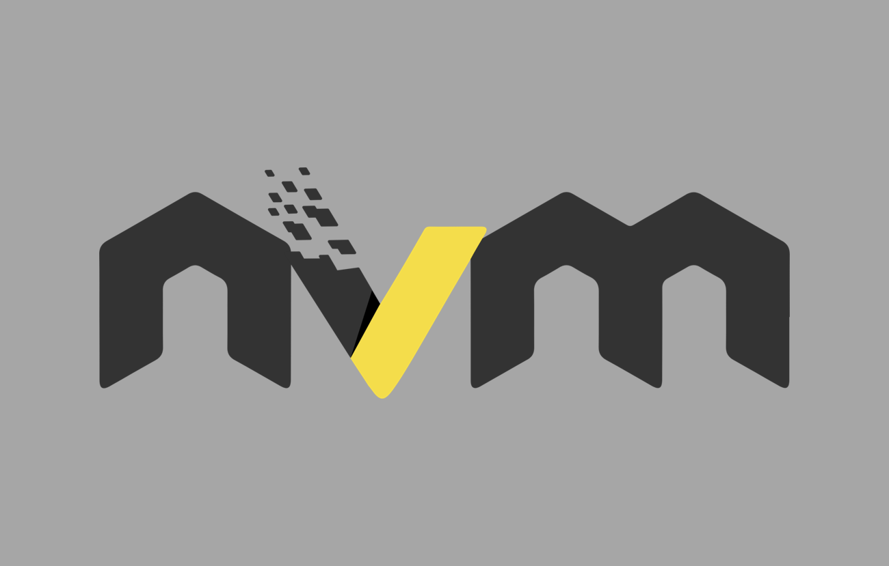

# Node Version Manager インストール手順

## Windows

### 1. `nvm-windows` ( Windows版 `Node.js` バージョンマネージャー)インストール

- [GitHub](https://github.com/coreybutler/nvm-windows) から *nvm-setup.exe* をダウンロード
- デフォルト設定でインストール

### 2. `node.js` (LTS版) インストール

```bash
nvm install lts
```

### 3. LTS版の使用

```bash
nvm use 22.12.0
```

> [!NOTE]
> - バージョン `nvm list` でインストール済みの値を指定
> - `nvm` で管理している `node.js` のパッケージは「 `~/AppData/Roaming/nvm/{nodeバージョン番号}/` 」に格納されている

## Mac

### 1. `nvm` インストール

```zsh
brew install nvm
```

### 2. `profile` 追加

```zsh
echo '' >> ~/.zshrc
echo '## nvm' >> ~/.zshrc
echo 'export NVM_DIR="$HOME/.nvm"' >> ~/.zshrc
echo '[ -s "/opt/homebrew/opt/nvm/nvm.sh" ] && \. "/opt/homebrew/opt/nvm/nvm.sh"' >> ~/.zshrc
echo '[ -s "/opt/homebrew/opt/nvm/etc/bash_completion.d/nvm" ] && \. "/opt/homebrew/opt/nvm/etc/bash_completion.d/nvm"' >> ~/.zshrc
```

### 3. `profile` 読み込み

```zsh
source ~/.zshrc
```

> [!NOTE]
> `nvm -v` でバージョンが表示されればOKです

## Linux

### 1. `nvm` インストール

```bash
curl -o- https://raw.githubusercontent.com/nvm-sh/nvm/v0.40.4/install.sh | bash
```

> [!NOTE]
> バージョンは実行時の最新に合わせてください

### 2. `profile` 追加

```bash
echo '' >> ~/.bashrc
echo '##nvm' >> ~/.bashrc
echo 'export NVM_DIR="$HOME/.nvm"' >> ~/.bashrc
echo '[ -s "$NVM_DIR/nvm.sh" ] && \. "$NVM_DIR/nvm.sh"' >> ~/.bashrc
echo '[ -s "$NVM_DIR/bash_completion" ] && \. "$NVM_DIR/bash_completion"' >> ~/.bashrc
```

### 3. `profile` 読み込み

```bash
source ~/.bashrc
```

> [!NOTE]
> `nvm -v` でバージョンが表示されればOKです

## 参考資料

### リファレンス

- [nvm-sh / nvm - GitHub](https://github.com/nvm-sh/nvm)

### ブログ

- [nvm-windowsでnode.jsのバージョン管理をする【Windows】](https://qiita.com/nezumori/items/504b26d26f3e6e3009e3)
- [[Node.js] nvmインストール手順(MacOS) - Zenn](https://zenn.dev/nok_c7/articles/536ac2d35bf9e6)
