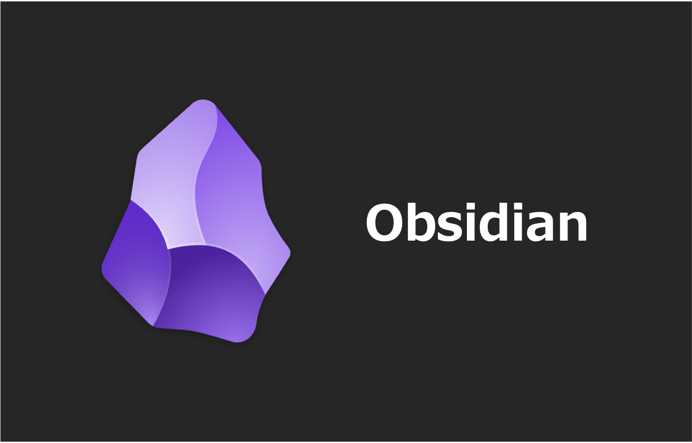

# Obsidian インストール手順

## Mac

### 1. `Obsidian` インストール

```zsh
brew install --cask obsidian
```

> [!NOTE]
>
> - `Applications` フォルダから `Obsidian` が起動できればOKです

## Windows

### 1. インストーラダウンロード

[Obsidian公式サイト](https://obsidian.md/) からインストーラをダウンロード

### 2. インストーラ実行

- インストーラを実行します。※基本デフォルトで問題ありません。
- インストール完了後、`Obsidian` が起動できればOKです

## 参考資料

### リファレンス

- [Obsidian 公式サイト](https://obsidian.md/)
- [Obsidian Help](https://obsidian.md/ja/help/)
- [Homebrew Formulae - obsidian](https://formulae.brew.sh/cask/obsidian)

### ブログ

- [【ハンズオン】Windows端末へObsidianをインストールする方法 - Qiita](https://qiita.com/mob_engineer/items/285aaabca54e8d685f04)
- [Obsidianを複数端末で同期する方法 - アシタカブログ](https://ashitaka-blog.com/obsidian%E3%82%92%E8%A4%87%E6%95%B0%E7%AB%AF%E6%9C%AB%E3%81%A7%E5%90%8C%E6%9C%9F%E3%81%99%E3%82%8B%E6%96%B9%E6%B3%95/)
