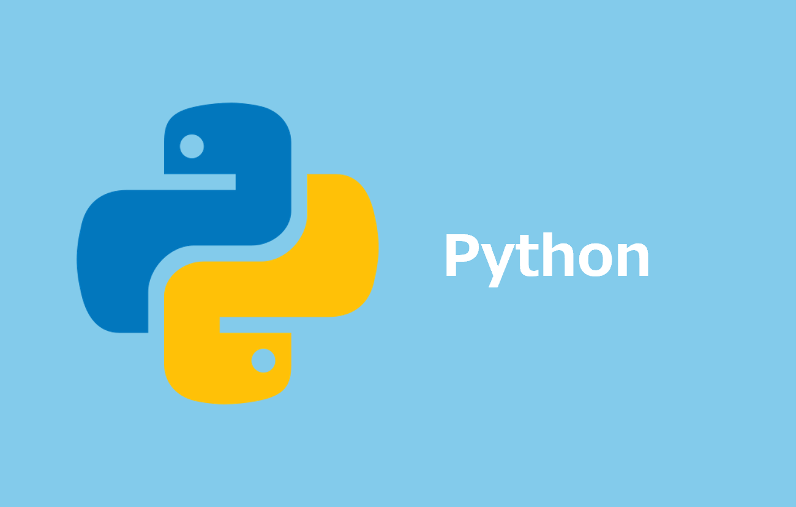

# Python Install Manager インストール手順 - Windows Only -

## 1. *pim* インストール

- [公式](https://www.python.org/downloads/windows/) より最新のインストーラー (`MSI package`) をダウンロード
- `msi` ファイルを実行してインストール

> [!NOTE]
> - ターミナルで `py list` が実行できればOKです

## 2. *python3* インストール - 最新版 -

```powershell
py install 3
```

> [!NOTE]
> - `python3 --version` でバージョンが表示されればOKです

## 3. *pip3* への `PATH` を通す

- 下記コマンドを実行し、グローバルショートカット用ディレクトリを取得

```powershell
py install --refresh
```

- 下記コマンドを `Powershell` で実行し、システムプロパティを起動
- 環境変数のシステム変数に上記コマンドで出力されたディレクトリを追加

```powershell
SystemPropertiesAdvanced
```

> [!NOTE]
> - ターミナルを再起動し、`pip3 --version` でバージョンが表示されればOKです

## 参考資料

### リファレンス

- [python.org](https://www.python.org/)
- [アプリ インストーラーのセキュリティ機能](https://learn.microsoft.com/ja-jp/windows/msix/app-installer/app-installer-security-features)
