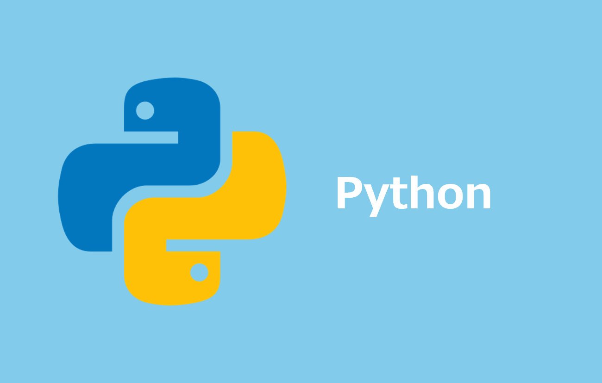

=====================================================================
Python インストール手順
=====================================================================

Windows
=====================================================================
1. *pyenv* (Pythonバージョン管理ツール)インストール
---------------------------------------------------------------------
* Windowsは *pyenv-win* をインストールする
* `GitHub <https://github.com/pyenv-win/pyenv-win/blob/master/README.md#installation>`_ からcloneする

.. code-block:: bash

  git clone https://github.com/pyenv-win/pyenv-win.git "$HOME\.pyenv"

2. ディレクトリにPATHを通す
---------------------------------------------------------------------
.. code-block:: bash

  echo 'export PATH="$HOME/.pyenv/pyenv-win/shims:$PATH"' >> ~/.bashrc
  echo 'export PATH="$HOME/.pyenv/pyenv-win/bin:$PATH"' >> ~/.bashrc
  source ~/.bashrc

.. note::

  * *pyenv --version* で *pyenv* のバージョン確認が可能
  * バージョン確認時にWindows環境変数への登録を促す文言が表示され気になる方はPowershell で登録してください

3. *python3.13* インストール
---------------------------------------------------------------------
.. code-block:: bash

  pyenv install 3.13.0

.. note::

  * *pyenv install --list* でインストール可能バージョン一覧を取得できます
  * *pyenv versions* でインストール済み *python* バージョン確認が可能

4. *Global* 設定
---------------------------------------------------------------------
.. code-block:: bash

  pyenv global 3.13.0

Linux
=====================================================================
1. *Amazon Linux 2023* のみ実施
---------------------------------------------------------------------
.. code-block:: bash

  sudo dnf update -y
  sudo dnf groupinstall -y "Development Tools"
  sudo dnf install -y bzip2-devel ncurses-devel libffi-devel readline-devel openssl-devel zlib-devel

2. *pyenv* (Pythonバージョン管理ツール)インストール
---------------------------------------------------------------------
.. code-block:: bash

  curl -fsSL https://pyenv.run | bash

3. ディレクトリにPATHを通す
---------------------------------------------------------------------
.. code-block:: bash

  echo 'export PYENV_ROOT="$HOME/.pyenv"' >> ~/.bashrc
  echo '[[ -d $PYENV_ROOT/bin ]] && export PATH="$PYENV_ROOT/bin:$PATH"' >> ~/.bashrc
  echo 'eval "$(pyenv init - bash)"' >> ~/.bashrc

4. *python3.13* インストール
---------------------------------------------------------------------
.. code-block:: bash

  pyenv install 3.13.0

.. note::

  * *pyenv install --list* でインストール可能バージョン一覧を取得できます
  * *pyenv versions* でインストール済み *python* バージョン確認が可能

5. *Global* 設定
---------------------------------------------------------------------
.. code-block:: bash

  pyenv global 3.13.0

.. note::

  * *python -V* でバージョンが表示されればOKです

=====================================================================
Pythonエラー解消
=====================================================================

Windows UTF-8問題
=====================================================================
Python3の文字エンコーディング設定を *UTF-8* に変更
---------------------------------------------------------------------
.. code-block:: bash

  PYTHONUTF8=1
  export PYTHONUTF8

.. note::

  * AWS CLIは *Python3* を内部的に使用
  * Windowsの文字コードは *cp932(Shift_JIS)* を使用
  * `aws cloudformation package` 実行時のyamlファイル出力時に、 *cp932* に伴うエラーが発生
  * *Python3* がファイルを出力する際の文字コードを環境変数にて *UTF-8* に指定

参考資料
=====================================================================
リファレンス
---------------------------------------------------------------------
* `pyenv - GitHub <https://github.com/pyenv/pyenv>`_

ブログ
---------------------------------------------------------------------
* `PythonでUTF-8エンコーディングを正しく扱う方法 <https://www.python.digibeatrix.com/archives/990>`_
