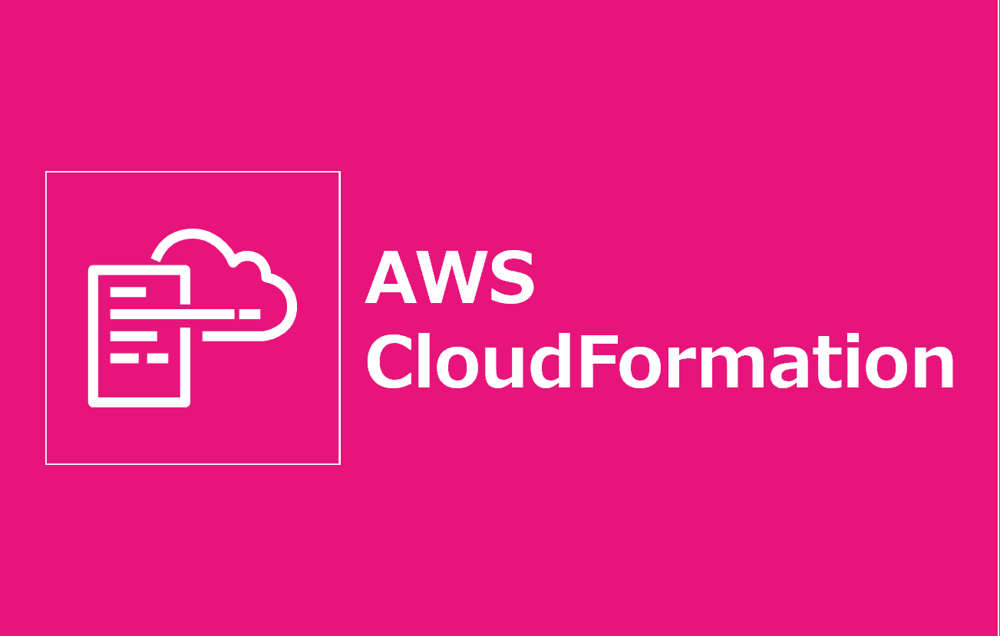

=====================================================================
rain(CloudFormation CLI実行ツール) インストール手順
=====================================================================

Windows
=====================================================================
1. *rain* リソースバイナリダウンロード
---------------------------------------------------------------------
* `GitHub release page <https://github.com/aws-cloudformation/rain/releases>`_ から64bit版バイナリ( *rain-v1.21.0_windows-amd64.zip* )をダウンロード

.. code-block:: bash

  RAIN_V=v1.20.2
  curl -o ~/Downloads/#1 -OL https://github.com/aws-cloudformation/rain/releases/download/${RAIN_V}/{rain-${RAIN_V}_windows-amd64.zip}

2. バイナリデータを任意のフォルダに解凍
---------------------------------------------------------------------
.. code-block:: bash

  unzip -d ~/ ~/Downloads/rain-${RAIN_V}_windows-amd64.zip
  rm -f ~/Downloads/rain-${RAIN_V}_windows-amd64.zip

3. ディレクトリにPATHを通す
---------------------------------------------------------------------
.. code-block:: bash

  touch ~/.bashrc # .bashrcがない場合実行
  sed -i '$aexport Rain_v=v1.20.2' ~/.bashrc
  sed -i '$aexport PATH=$PATH:$HOME/rain-${RAIN_V}_windows-amd64' ~/.bashrc
  source ~/.bashrc

Mac
=====================================================================
1. *rain* インストール
---------------------------------------------------------------------
.. code-block:: zsh

  brew install rain

Linux
=====================================================================
1. *rain* リソースバイナリダウンロード
---------------------------------------------------------------------
* `GitHub release page <https://github.com/aws-cloudformation/rain/releases>`_ から64bit版バイナリ( *rain-v1.24.2_linux-amd64.zip* )をダウンロード

.. code-block:: bash

  RAIN_V=v1.24.2
  curl -OL https://github.com/aws-cloudformation/rain/releases/download/${RAIN_V}/rain-${RAIN_V}_linux-amd64.zip

2. バイナリデータを任意のフォルダに解凍
---------------------------------------------------------------------
.. code-block:: bash

  unzip rain-${RAIN_V}_linux-amd64.zip
  mkdir -p ~/bin; mv rain-${RAIN_V}_linux-amd64/rain ~/bin/; rm -rf rain*

参考資料
=====================================================================
リファレンス
-------------------------------
* `GitHub - aws-cloudformation/rain <https://github.com/aws-cloudformation/rain>`_
ブログ
-------------------------------
* `WindowsでCloudFormation Rainを動くようにしてみた <https://dev.classmethod.jp/articles/try-cloudformation-rain-on-windows/#toc-7>`_

