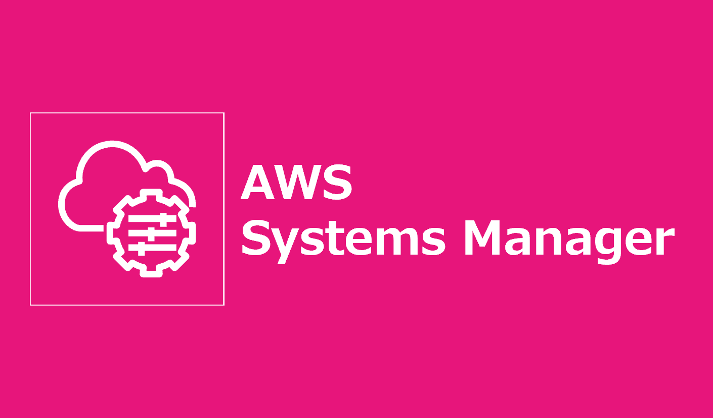

=====================================================================
Session Manager プラグイン インストール手順
=====================================================================

Windows
===================
1. パッケージダウンロード
-----------------------------------
ブラウザで下記URLを入力

.. code-block::

  https://s3.amazonaws.com/session-manager-downloads/plugin/latest/windows/SessionManagerPluginSetup.exe

2. インストーラ実行
------------------------------------
ダウンロードしたインストーラを実行

3. インストール確認
------------------------------------
.. code-block:: bash

  session-manager-plugin

参考資料
===============================
リファレンス
-------------------------------
* `AWS CLI 用の Session Manager プラグインをインストールする <https://docs.aws.amazon.com/ja_jp/systems-manager/latest/userguide/session-manager-working-with-install-plugin.html>`_
