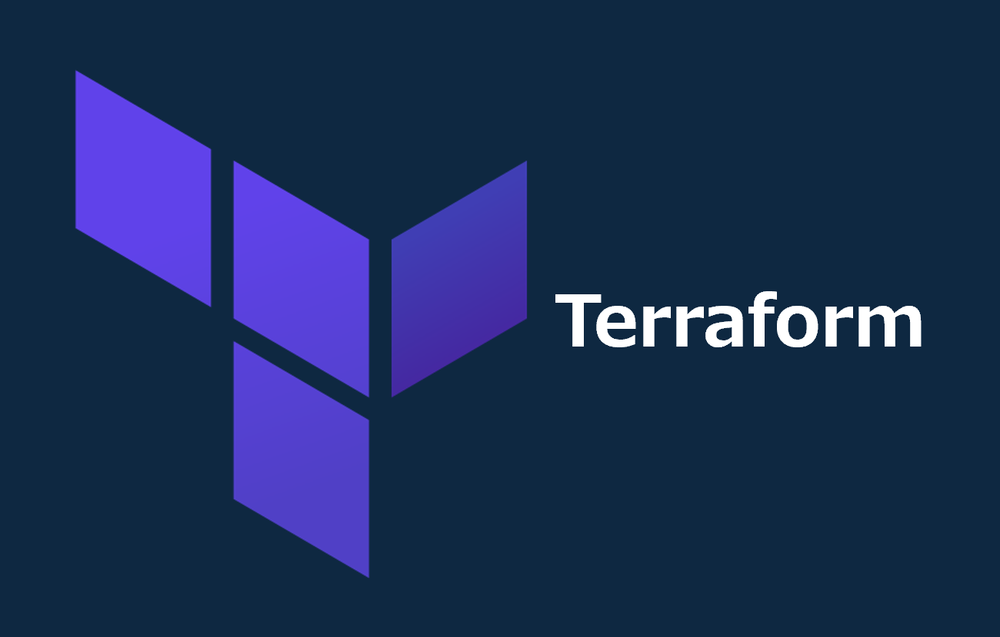

# tenv / Terraform / TFTUI インストール手順

> [!NOTE]
> - *Terraform* は HashiCorp が提供する、コードでインフラを定義・構築する IaC ツール
> - *tenv* は *Terraform* / *OpenTofu* 等のバージョン管理ツールで、プロジェクトごとにバージョンを切り替えるために使用
> - *TFTUI* は *Terraform* の state をターミナル上で閲覧・操作する TUI ツール

## Windows (Git for Windows)

### 1. *tenv* (Terraformバージョンマネージャー)リリースバイナリダウンロード

- [GitHub](https://github.com/tofuutils/tenv/releases) から64bit版バイナリ( *tenv_v4.1.0_Windows_x86_64.zip* )をダウンロード

> [!NOTE]
> バージョンはインストールする値に修正してください

### 2. バイナリデータを任意のフォルダに解凍

```bash
mkdir -p ~/tofuutils/tenv/
unzip -d ~/tofuutils/tenv/ ~/Downloads/tenv_v4.1.0_Windows_x86_64.zip
rm ~/Downloads/tenv_v4.1.0_Windows_x86_64.zip
```

> [!NOTE]
> バージョンはインストールした値に修正してください

### 3. ディレクトリにPATHを通す

```bash
export PATH=$PATH:$HOME/tofuutils/tenv/
touch ~/.bashrc # .bashrcがない場合実行
sed -i '$aexport PATH=$PATH:$HOME/tofuutils/tenv/' ~/.bashrc
```

### 4. *Terraform* 最新版インストール

```bash
tenv tf install latest # ~/.tenv/Terraform/バージョン番号/に保存される
```

### 5. 使用するバージョンの指定

```bash
tenv tf list # インストールしたバージョンを確認
tenv tf use v1.10.3
```

> [!NOTE]
> - バージョンはインストールした値に修正してください
> - *terraform -v* でバージョンが表示されればOKです

## Mac

### 1. *tenv* (Terraformバージョンマネージャー) インストール

```zsh
brew install tenv
```

### 2. *Terraform* 最新版インストール

```zsh
tenv tf install latest # ~/.tenv/Terraform/バージョン番号/に保存される
```

### 3. 使用するバージョンの指定

```bash
tenv tf list # インストールしたバージョンを確認
tenv tf use v1.14.1
```

> [!NOTE]
> - バージョンはインストールした値に修正してください
> - *terraform -v* でバージョンが表示されればOKです

## Linux

### 1. *cosign(v.2.0+)* インストール

> [!NOTE]
> - 最新バージョンの取得に *jq* を使用するため、未インストールの場合は事前に `sudo dnf install -y jq` を実行してください

```bash
cd
LATEST_VERSION=$(curl https://api.github.com/repos/sigstore/cosign/releases/latest | jq -r .tag_name | tr -d "v")
curl -O -L "https://github.com/sigstore/cosign/releases/latest/download/cosign-${LATEST_VERSION}-1.x86_64.rpm"
sudo rpm -ivh cosign-${LATEST_VERSION}-1.x86_64.rpm && rm -rf cosign-${LATEST_VERSION}-1.x86_64.rpm
```

### 2. リポジトリ登録

```bash
curl -1sLf 'https://dl.cloudsmith.io/public/tofuutils/tenv/cfg/setup/bash.rpm.sh' | sudo bash
```

### 3. *tenv* インストール

```bash
sudo dnf install tenv -y
```

### 4. *Terraform* 最新版インストール

```bash
tenv tf install latest # ~/.tenv/Terraform/バージョン番号/に保存される
```

### 5. 使用するバージョンの指定

```bash
tenv tf list # インストールしたバージョンを確認
tenv tf use v1.10.3
```

> [!NOTE]
> - バージョンはインストールした値に修正してください
> - *terraform -v* でバージョンが表示されればOKです

## Terraform 共通設定

### gitignore

- [gitignore.io](https://www.toptal.com/developers/gitignore) にて *terraform* と入力し *.gitignore* を作成
- terraformコードを格納するフォルダに保存

## Terraform TUI

### Windows

#### 1. *tftui* インストール

- [GitHub](https://github.com/idoavrah/terraform-tui/tree/main) のパッケージを *uv* でインストール

```bash
uv tool install tftui
```

> [!NOTE]
> - *uv* のセットアップは [こちら](../uv_python3/README.md) を参照
> - `uv tool list` に *tftui* が表示されればOKです

> [!TIP]
> - *pyenv* ( [こちら](../pyenv_python3/README.md) ) や *PIM* ( [こちら](../pim/README.md) ) で *Python* をインストールしている場合は、 *pip* でもインストール可能です
>
> ```bash
> pip install tftui
> ```

### Mac

#### 1. *tftui* インストール

```zsh
brew install idoavrah/homebrew/tftui
```

## 参考資料

### リファレンス

- [tofuutils/tenv - GitHub](https://github.com/tofuutils/tenv)
- [idoavrah/terraform-tui - GitHub](https://github.com/idoavrah/terraform-tui/tree/main)
- [gitignore.io](https://www.toptal.com/developers/gitignore)

### ブログ

- [新しいTerraformのバージョンマネージャー tenv を試してみた](https://dev.classmethod.jp/articles/try-tenv-terraform-version-manager/)
- [kazmax - Linuxで自宅サーバー](https://kazmax.zpp.jp/linux_beginner/yum_repository_enable_disable.html)
