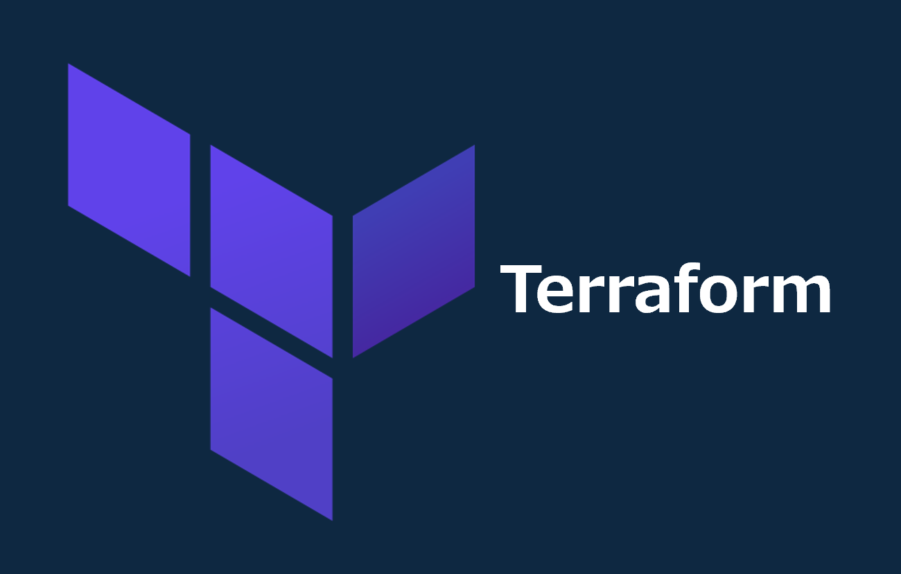

=====================================================================
Terraform インストール手順
=====================================================================

Windows
=====================================================================
1. *tenv* (Terraformバージョンマネージャー)リリースバイナリダウンロード
---------------------------------------------------------------------
* `GitHub <https://github.com/tofuutils/tenv/releases>`_ から64bit版バイナリ( *tenv_v4.1.0_Windows_x86_64.zip* )をダウンロード

.. note::

  バージョンはインストールする値に修正してください

2. バイナリデータを任意のフォルダに解凍
---------------------------------------------------------------------
.. code-block:: bash

  mkdir -p ~/tofuutils/tenv/
  unzip -d ~/tofuutils/tenv/ ~/Downloads/tenv_v4.1.0_Windows_x86_64.zip
  rm ~/Downloads/tenv_v4.1.0_Windows_x86_64.zip

.. note::

  バージョンはインストールした値に修正してください

3. ディレクトリにPATHを通す
---------------------------------------------------------------------
.. code-block:: bash

  export PATH=$PATH:$HOME/tofuutils/tenv/
  touch ~/.bashrc # .bashrcがない場合実行
  sed -i '$aexport PATH=$PATH:$HOME/tofuutils/tenv/' ~/.bashrc

4. *Terraform* 最新版インストール
---------------------------------------------------------------------
.. code-block:: bash

  tenv tf install latest # ~/.tenv/Terraform/バージョン番号/に保存される

5. *v.1.10.3* を使用
---------------------------------------------------------------------
.. code-block:: bash

  tenv tf list # インストールしたバージョンを確認
  tenv tf use v1.10.3

.. note::

  * バージョンはインストールした値に修正してください
  * *terraform -v* でバージョンが表示されればOKです

Mac
=====================================================================
1. *tenv* (Terraformバージョンマネージャー) インストール
---------------------------------------------------------------------
.. code-block:: zsh

  brew install tenv

2. *Terraform* 最新版インストール
---------------------------------------------------------------------
.. code-block:: zsh

  tenv tf install latest # ~/.tenv/Terraform/バージョン番号/に保存される

3. *v.1.14.1* を使用
---------------------------------------------------------------------
.. code-block:: bash

  tenv tf list # インストールしたバージョンを確認
  tenv tf use v1.14.1

.. note::

  * バージョンはインストールした値に修正してください
  * *terraform -v* でバージョンが表示されればOKです

Linux
=====================================================================
1. *cosign(v.2.0+)* インストール
---------------------------------------------------------------------
.. code-block:: bash

  cd
  LATEST_VERSION=$(curl https://api.github.com/repos/sigstore/cosign/releases/latest | jq -r .tag_name | tr -d "v")
  curl -O -L "https://github.com/sigstore/cosign/releases/latest/download/cosign-${LATEST_VERSION}-1.x86_64.rpm"
  sudo rpm -ivh cosign-${LATEST_VERSION}-1.x86_64.rpm && rm -rf cosign-${LATEST_VERSION}-1.x86_64.rpm

2. リポジトリ登録
---------------------------------------------------------------------
.. code-block:: bash

  curl -1sLf 'https://dl.cloudsmith.io/public/tofuutils/tenv/cfg/setup/bash.rpm.sh' | sudo bash

3. *tenv* インストール
---------------------------------------------------------------------
.. code-block:: bash

  sudo dnf install tenv -y

4. *Terraform* 最新版インストール
---------------------------------------------------------------------
.. code-block:: bash

  tenv tf install latest # ~/.tenv/Terraform/バージョン番号/に保存される

5. *v.1.10.3* を使用
---------------------------------------------------------------------
.. code-block:: bash

  tenv tf list # インストールしたバージョンを確認
  tenv tf use v1.10.3

.. note::

  * バージョンはインストールした値に修正してください
  * *terraform -v* でバージョンが表示されればOKです

=====================================================================
Terraform 共通設定
=====================================================================

gitignore
=====================================================================
* `gitignore.io <https://www.toptal.com/developers/gitignore>`_ にて *terraform* と入力し *.gitignore* を作成
* terraformコードを格納するフォルダに保存

=====================================================================
Terraform TUI
=====================================================================

Windows
=====================================================================
1. *tftui* インストール
---------------------------------------------------------------------
* `GitHub <https://github.com/idoavrah/terraform-tui/tree/main>`_ から *pip* でインストール

.. code-block:: bash

  pip install tftui

Mac
=====================================================================
1. *tftui* インストール
---------------------------------------------------------------------
.. code-block:: zsh

  brew install idoavrah/homebrew/tftui

参考資料
=====================================================================
リファレンス
---------------------------------------------------------------------
* `tofuutils/tenv - GitHub <https://github.com/tofuutils/tenv>`_
* `idoavrah/terraform-tui - GitHub <https://github.com/idoavrah/terraform-tui/tree/main>`_
* `gitignore.io <https://www.toptal.com/developers/gitignore>`_

ブログ
---------------------------------------------------------------------
* `新しいTerraformのバージョンマネージャー tenv を試してみた <https://dev.classmethod.jp/articles/try-tenv-terraform-version-manager/>`_
* `kazmax - Linuxで自宅サーバー <https://kazmax.zpp.jp/linux_beginner/yum_repository_enable_disable.html>`_
