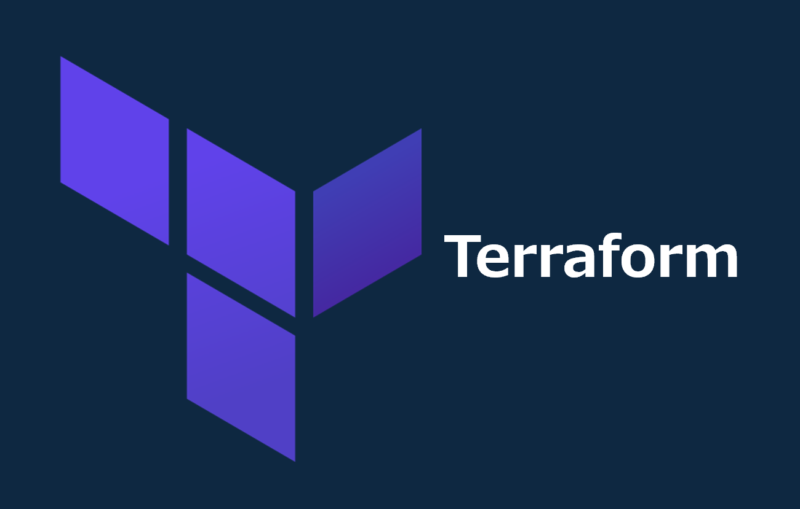

=====================================================================
Terraform インストール手順
=====================================================================

Windows
===================
1. *tenv* (Terraformバージョンマネージャー)リリースバイナリダウンロード
--------------------------------------------------------------------
* `GitHub <https://github.com/tofuutils/tenv/releases>`_ から64bit版バイナリ( *tenv_v4.1.0_Windows_x86_64.zip* )をダウンロード

2. バイナリデータを任意のフォルダに解凍
-------------------------------------
.. code-block:: bash

  mkdir -p ~/tofuutils/tenv/
  unzip -d ~/tofuutils/tenv/ ~/Downloads/tenv_v4.1.0_Windows_x86_64.zip
  rm ~/Downloads/tenv_v4.1.0_Windows_x86_64.zip

3. ディレクトリにPATHを通す
-------------------------------------
.. code-block:: bash

  export PATH=$PATH:$HOME/tofuutils/tenv/
  touch ~/.bashrc # .bashrcがない場合実行
  sed -i '$aexport PATH=$PATH:$HOME/tofuutils/tenv/' ~/.bashrc

4. *Terraform* 最新版インストール
--------------------------------------
.. code-block:: bash

  tenv tf install latest # ~/.tenv/Terraform/バージョン番号/に保存される

5. *v.1.10.3* を使用
--------------------------------------
.. code-block:: bash

  tenv tf list # インストールしたバージョンを確認
  tenv tf use v1.10.3

=====================================================================
Terraform 共通設定
=====================================================================
gitignore
---------------------
* `gitignore.io <https://www.toptal.com/developers/gitignore>`_ にて *terraform* と入力し *.gitignore* を作成
* terraformコードを格納するフォルダに保存

参考資料
===============================
リファレンス
-------------------------------
* `gitignore.io <https://www.toptal.com/developers/gitignore>`_

ブログ
-------------------------------
* `新しいTerraformのバージョンマネージャー tenv を試してみた <https://dev.classmethod.jp/articles/try-tenv-terraform-version-manager/>`_
