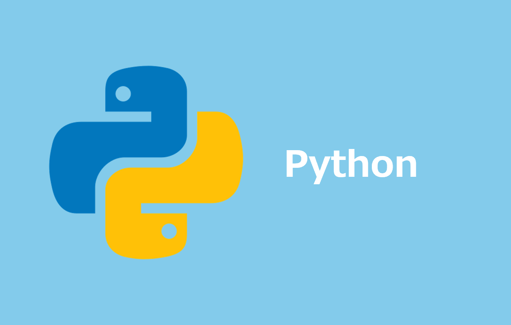

# uv インストール手順

## Windows (Git for Windows)

### 1. *uv* インストール

```bash
winget install --id=astral-sh.uv -e --accept-source-agreements --accept-package-agreements
```

> [!NOTE]
> - 一度 IDE(もしくはターミナル)を閉じてください
> - その後、 `uv --version` でバージョンが表示されればOKです
> - `--accept-*-agreements` は初回実行時の規約同意プロンプトを省略するオプションです

> [!TIP]
> - `winget` が利用できない環境 (古い Windows 10 / Windows Server / Microsoft Store 制限環境など) では、公式の PowerShell スクリプトを Git Bash から実行してください
>
> ```bash
> powershell -ExecutionPolicy ByPass -c "irm https://astral.sh/uv/install.ps1 | iex"
> ```

### 2. *python3.13* インストール

```bash
uv python install 3.13 --default
```

> [!NOTE]
> - `--default` を付けると、 `python` / `python3` コマンドも `~/.local/bin` に配置されます ( *experimental* な機能です)
> - `uv python list` でインストール可能 / インストール済みバージョン一覧を取得できます

### 3. ディレクトリにPATHを通す

```bash
echo 'export PATH="$HOME/.local/bin:$PATH"' >> ~/.bashrc
source ~/.bashrc
```

> [!NOTE]
> - `python --version` でバージョンが表示されればOKです

### 4. シェル補完

```bash
echo 'eval "$(uv generate-shell-completion bash)"' >> ~/.bashrc
source ~/.bashrc
```

## Mac

### 1. *uv* インストール

```zsh
brew install uv
```

> [!NOTE]
> - `uv --version` でバージョンが表示されればOKです

### 2. *python3.13* インストール

```zsh
uv python install 3.13 --default
```

> [!NOTE]
> - `--default` を付けると、 `python` / `python3` コマンドも `~/.local/bin` に配置されます ( *experimental* な機能です)
> - `uv python list` でインストール可能 / インストール済みバージョン一覧を取得できます

### 3. ディレクトリにPATHを通す

```zsh
echo '' >> ~/.zshrc
echo '## uv' >> ~/.zshrc
echo 'export PATH="$HOME/.local/bin:$PATH"' >> ~/.zshrc
source ~/.zshrc
```

> [!NOTE]
> - `python --version` でバージョンが表示されればOKです

### 4. シェル補完

```zsh
echo 'eval "$(uv generate-shell-completion zsh)"' >> ~/.zshrc
source ~/.zshrc
```

## Linux

### 1. *uv* インストール

```bash
curl -LsSf https://astral.sh/uv/install.sh | sh
source $HOME/.local/bin/env
```

> [!NOTE]
> - インストーラが `~/.local/bin` に *uv* を配置し、シェルのプロファイルに PATH を追記します
> - `uv --version` でバージョンが表示されればOKです

### 2. *python3.13* インストール

```bash
uv python install 3.13 --default
```

> [!NOTE]
> - `--default` を付けると、 `python` / `python3` コマンドも `~/.local/bin` に配置されます ( *experimental* な機能です)
> - `python --version` でバージョンが表示されればOKです

### 3. シェル補完

```bash
echo 'eval "$(uv generate-shell-completion bash)"' >> ~/.bashrc
source ~/.bashrc
```

## `exclude-newer` 設定

- 公開されてから一定期間経過したパッケージのみインストールを許容する設定 ( *pnpm* の `minimumReleaseAge` と同趣旨)
- ユーザー単位の設定ファイル ( `uv.toml` ) に記載します

### Windows (Git for Windows)

```bash
mkdir -p $APPDATA/uv
cat <<EOF > $APPDATA/uv/uv.toml
exclude-newer = "7 days"
EOF
```

### Mac / Linux

```bash
mkdir -p ~/.config/uv
cat <<EOF > ~/.config/uv/uv.toml
exclude-newer = "7 days"
EOF
```

> [!NOTE]
> - 値は `24 hours` / `1 week` / `30 days` のような形式や、 ISO 8601 形式 ( `P7D` ) でも指定できます

> [!WARNING]
> - 既に `uv.toml` がある場合は上書きされるため、追記してください

# Pythonエラー解消

## Windows UTF-8問題

### Python3の文字エンコーディング設定を *UTF-8* に変更

> [!NOTE]
> - Git Bash (Git for Windows) を前提としたコマンドです

```bash
echo 'export PYTHONUTF8=1' >> ~/.bashrc
source ~/.bashrc
```

> [!NOTE]
> - Windows 上の *Python3* は、ファイル読み書き時の既定の文字コードに *cp932(Shift_JIS)* を使用します
> - そのため、 *Python* 製のツールやスクリプト全般で以下のような問題が発生し得ます
>   - 日本語を含む UTF-8 のファイル (YAML / JSON / Markdown 等) 読み込み時の `UnicodeDecodeError: 'cp932' codec can't decode ...`
>   - パイプやリダイレクト ( `> out.txt` / `| jq` 等) で出力した際の文字化け
>   - `pip install` 時のパッケージビルドエラー
> - 例えば *AWS CLI* では、 `aws cloudformation package` 実行時の yaml ファイル出力でエラーが発生します
> - 環境変数 `PYTHONUTF8=1` で *UTF-8 モード* を有効化し、 *Python3* の既定の文字コードを *UTF-8* にします
> - *Python3.15* 以降は *UTF-8 モード* が既定で有効になる予定です ( *PEP 686* )

## 参考資料

### リファレンス

- [Installation - uv](https://docs.astral.sh/uv/getting-started/installation/)
- [Installing Python - uv](https://docs.astral.sh/uv/guides/install-python/)
- [Settings - uv](https://docs.astral.sh/uv/reference/settings/)
- [PEP 686 – Make UTF-8 mode default](https://peps.python.org/pep-0686/)
